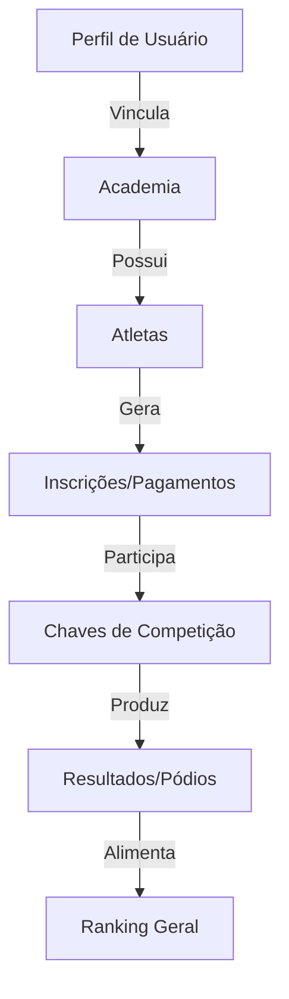

# 🛡️ Documentação Técnica: Dojang Digital
> **Projeto:** Festival União Lopes 2026 | **Princípio:** Baekjool Boolgool (Espírito Indomável)

Esta documentação detalha a arquitetura, lógica de negócios e infraestrutura da plataforma de gestão do Festival de Taekwondo 2026, projetada para ser resiliente, ética e de alto impacto.

---

## 🥋 1. Filosofia de Engenharia
A plataforma segue o **"Algoritmo Indomável"**:
1. **Simplicidade para Proteger**: Arquiteturas enxutas reduzem a superfície de ataque e facilitam a manutenção.
2. **Integridade de Dados**: Cada bit de informação (do atleta à pontuação) é tratado com a ética marcial.
3. **Escalabilidade**: Preparada para suportar múltiplas academias e centenas de atletas simultâneos.

---

## 📊 2. Fluxo de Dados (Data Flow)
O diagrama abaixo ilustra como as entidades se relacionam dentro do ecossistema Firebase/Firestore.



---

## 🏗️ 3. Arquitetura Técnica

### Stack de Tecnologia
- **Frontend**: React 18 + Vite (SPA).
- **Estilização**: Vanilla CSS + Tailwind (Design de alta fidelidade e performance).
- **Backend (BaaS)**: Firebase (Authentication, Firestore, Storage).
- **Hospedagem**: Google Cloud Run (Containerizado).

### Estrutura do Firestore
| Coleção | Descrição | Regras de Acesso |
| :--- | :--- | :--- |
| `users` | Perfis e funções (Admin/Master). | Somente o próprio usuário ou Admin. |
| `academies` | Cadastro das escolas de Taekwondo. | Mestre (leitura/escrita) e Admin. |
| `athletes` | Base de dados de alunos. | Mestre da academia vinculada ou Admin. |
| `registrations` | Inscrições em categorias e comprovantes. | Mestre da academia ou Admin. |

---

## 🏆 4. Lógica de Competição e Ranking

### Gestão de Chaves (Brackets)
O sistema implementa uma lógica determinística para geração de confrontos:
- **Tamanhos Suportados**: 2, 4 e 8 atletas.
- **Distribuição**: Alocação automática baseada na ordem de cadastro (ou randomização futura).
- **Progressão**: O vencedor de cada luta avança para o próximo nó até a final.

### Sistema de Pontuação (Ranking)
A pontuação é calculada de forma agregada por Academia:

| Colocação | Pontuação | Medalha |
| :---: | :---: | :---: |
| **1º Lugar** | 10 pts | 🥇 Ouro |
| **2º Lugar** | 7 pts | 🥈 Prata |
| **3º Lugar** | 5 pts | 🥉 Bronze |

**Critério de Desempate**:
1. Maior número de medalhas de Ouro.
2. Maior número de medalhas de Prata.
3. Maior número de medalhas de Bronze.
4. Ordem Alfabética.

---

## 🚀 5. Pipeline de Infraestrutura (GCP)

A plataforma utiliza um modelo de contêineres gerenciados para máxima disponibilidade e custo-benefício.

### Fluxo de Deploy (CI/CD)
1. **Containerização**: Utiliza uma `Dockerfile` multi-stage para gerar uma imagem leve (Node 22 Slim).
2. **Registro**: A imagem é enviada para o **Artifact Registry** do GCP.
3. **Runtime**: Hospedada no **Google Cloud Run** com auto-scaling.

**Comando de Produção:**
```bash
gcloud run deploy fest2026-tkd \
  --project fest2026-tkd-dev \
  --region southamerica-east1 \
  --source . \
  --allow-unauthenticated
```

---

## 🛡️ 6. Segurança e Governança
- **Isolamento de Dados**: Mestres estão restritos ao `academyId` vinculado ao seu perfil.
- **Sincronização Reativa**: Listeners Firestore otimizados no `App.tsx` garantem que o Dashboard reflita a realidade em tempo real assim que os dados são salvos.
- **Auditoria**: Todas as alterações críticas em resultados são monitoradas (via histórico de documentos no Firestore).

---
> **"Scientia Potentia Est"** - Indomitable Spirit Data Lab 2026.
